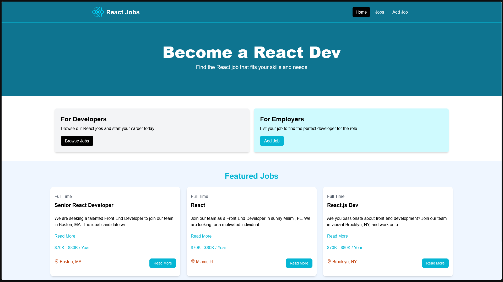
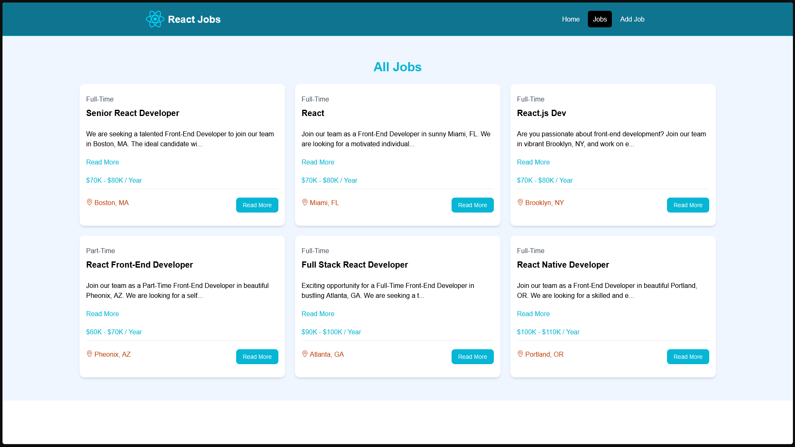
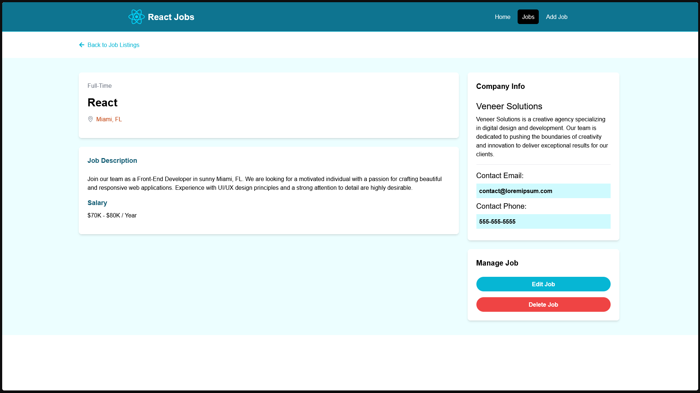
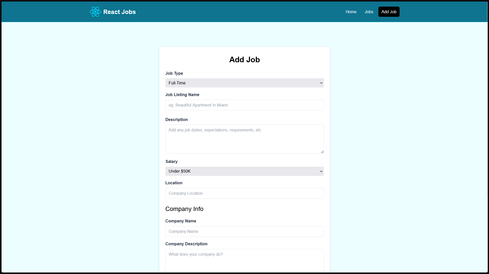

Here's the code for the README.md file:

# React Job Application App

This is a **React-based Job Application App** that allows users to search for job postings, view job details, and save their favorite job opportunities. It can serve as a personal job tracker or a job board aggregator.





## Table of Contents

1. [Features](#features)  
2. [Installation](#installation)  
3. [Usage](#usage)  
4. [Technologies Used](#technologies-used)  
5. [Contributing](#contributing)  
6. [License](#license)

---

## Features


- **Job Details**: Detailed view of job postings with descriptions, requirements, and application links.
- **Responsive Design**: Optimized for mobile and desktop devices.

---

## Installation

### Prerequisites
Ensure you have the following installed on your system:
- [Node.js](https://nodejs.org/) (v16 or above)
- [npm](https://www.npmjs.com/) or [yarn](https://yarnpkg.com/)

### Steps
1. Clone the repository:
   ```bash
   git clone https://github.com/your-username/react-job-app.git
   cd react-job-app
2. Install dependencies:
    ```bash
    npm install
    # OR
    yarn install
3.  Create a .env file in the root directory to configure environment variables (API keys endpoints):
    ```bash
    REACT_APP_API_KEY=your-api-key-here
    REACT_APP_API_URL=https://example.com/api
4. Start the development server:
    ```bash
    npm start
    # OR
    yarn start
5. Open your browser and navigate to http://localhost:3000.

## Usage

    Use the search bar on the homepage to find job opportunities by keyword and location.
    Click on a job posting to view detailed information and application options.
    Add jobs to your favorites list by clicking the "Save" button.
    Access your saved jobs from the "Favorites" section in the navigation menu.

## Technologies Used

    Frontend:
        React.js (with Hooks and Context API)
        React Router for routing
        Styled Components / Tailwind CSS for styling
    
         Backend/API:
        Integrated with third-party job APIs (e.g., LinkedIn Jobs, Adzuna, or custom REST API).

    Tools:
        Axios for API requests
        React Query / Redux Toolkit for state management (if needed)
        Jest and React Testing Library for testing

## Contributing

Contributions are welcome! To contribute:

Fork this repository.
Create a new branch:

    git checkout -b feature-name
Commit your changes:

    git commit -m "Add new feature"
Push to your branch:

    git push origin feature-name
Submit a pull request.

## License

This project is licensed under the MIT License. See the LICENSE file for more information.


Copy and save this code as `README.md` in your project directory. It will serve as the documentation for your React Job Application App.

